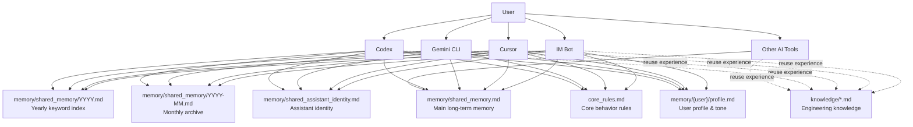

# Shared Brain Skill

Set up a **unified long-term memory** architecture so that multiple AI entry points — IM bots, Cursor, Gemini CLI, Codex, or any future tool — read from and write to the **same** memory, identity, and rules. No more "amnesia" when switching tools.

## Core Philosophy

1. **Single Source of Truth** — One main memory file. Not two, not three. One.
2. **Append-Only** — All entry points only append. Never overwrite, never delete, never reorder.
3. **Separation of Concerns** — Identity, rules, user profile, and memory are separate files.
4. **Memory ≠ Knowledge** — Shared memory stores *who you are and what you decided*. Engineering knowledge (bug fixes, scripts, workflows) goes to a separate knowledge base.

---

## Architecture Overview



Every entry point converges on the same set of files. `shared_memory.md` holds the current long-term context. Archives hold history. `shared_assistant_identity.md` defines *who the assistant is*. `core_rules.md` defines *how to behave*. `profile.md` defines *how to talk to this user*. `knowledge/*.md` stores engineering-specific reusable knowledge separately.

---

## Phase 0: Detect Mode

Determine what the user needs:

| Mode | When | Next Phase |
|------|------|------------|
| **A: Fresh Setup** | No shared memory exists yet | Phase 1 |
| **B: Migration** | User has scattered memory files, wants to unify | Phase 1 (with import) |
| **C: Add Entry Point** | Shared memory exists, adding a new AI tool | Phase 2 |

---

## Phase 1: Initialize Shared Memory

### Step 1.1: Choose Memory Root

Ask the user where to place the memory directory. Common patterns:

| Project Type | Recommended Root |
|-------------|-----------------|
| Single monorepo | `./memory/` in project root |
| Multi-project | A dedicated shared directory (e.g. `~/my-project/memory/`) |
| Personal assistant | Under the bot/assistant project (e.g. `~/Bot-Project/memory/`) |

### Step 1.2: Create Directory Structure

Create the following directory tree. Use the templates from the `templates/` folder in this skill:

```
{memory_root}/
├── shared_memory.md                    # Main long-term memory (from templates/shared_memory.md)
├── shared_assistant_identity.md        # Assistant identity (from templates/shared_assistant_identity.md)
├── shared_memory/                      # Archive directory
│   ├── {YYYY}.md                       # Yearly keyword index (create when needed)
│   └── {YYYY-MM}.md                    # Monthly archive (create when needed)
├── {user_id}/                          # Per-user directory (optional)
│   └── profile.md                      # User profile & tone preferences
└── core_rules.md                       # Core behavior rules
```

### Step 1.3: Populate Initial Content

For each file, read the corresponding template and customize it:

1. **`shared_memory.md`** — Start with a header and the first entry:
   ```md
   # Shared Long-Term Memory

   <!-- All entries use append-only format: [YYYY-MM-DD HH:MM] summary -->

   [YYYY-MM-DD HH:MM] Initialized shared memory system.
   ```

2. **`shared_assistant_identity.md`** — Ask the user about their assistant's personality, name, tone, and thinking style. Fill in the template.

3. **`core_rules.md`** — Ask the user about their hard rules (e.g., "always execute commands directly", "use Chinese for responses", "never overwrite files without asking"). Fill in the template.

4. **`profile.md`** — Ask the user about their personal preferences, communication style, and any context the assistant should always remember.

### Step 1.4: Migration (Mode B Only)

If the user has existing memory files:

1. Scan for existing memory/context files in the project.
2. Present a list of found files and ask which to import.
3. Merge content into `shared_memory.md` in chronological order.
4. Archive older entries into `{YYYY-MM}.md` files as appropriate.
5. **Do not delete** the original files — let the user do that manually.

---

## Phase 2: Configure Entry Points

For each AI tool the user wants to connect, set up explicit rules that tell the tool where to find and how to use the shared memory. The key principle is: **never rely on the tool "just knowing"** — always write explicit rules.

### Entry Point: Cursor (via `.cursor/rules/`)

Create `.cursor/rules/shared-memory.mdc` in the project root:

```markdown
---
description: Shared memory rules — read/write the unified long-term memory
globs:
alwaysApply: true
---

## Shared Memory System

### Files to Read (on every conversation start)
1. `{memory_root}/shared_memory.md` — Main long-term memory
2. `{memory_root}/shared_assistant_identity.md` — Who you are
3. `{memory_root}/core_rules.md` — How to behave
4. `{memory_root}/{user_id}/profile.md` — User preferences & tone

### Archive Lookup (when main file doesn't have enough info)
1. Check `{memory_root}/shared_memory/{YYYY}.md` for yearly keyword index
2. Open the matching `{memory_root}/shared_memory/{YYYY-MM}.md` for full context

### Write Rules
- **Append only** — never delete, overwrite, or reorder existing entries
- **Format**: `[YYYY-MM-DD HH:MM] one-line summary`
- **When to write**: After completing a task, confirming a preference, or making an important decision
- **What to write to shared memory**: User preferences, identity rules, long-term decisions
- **What NOT to write here** (write to `knowledge/` instead): Bug fixes, scripts, workflows, environment gotchas
```

### Entry Point: Gemini CLI (via `GEMINI.md` or global rules)

Create a `GEMINI.md` in the project root, or add to the existing global rules:

```markdown
## Shared Memory System

Read these files at the start of every conversation:
1. `{memory_root}/shared_memory.md`
2. `{memory_root}/shared_assistant_identity.md`
3. `{memory_root}/core_rules.md`
4. `{memory_root}/{user_id}/profile.md`

When the main memory file doesn't contain enough information:
1. Check `{memory_root}/shared_memory/{YYYY}.md` for yearly keyword index
2. Open the matching `{memory_root}/shared_memory/{YYYY-MM}.md`

Write rules:
- Append only. Never delete or overwrite.
- Format: `[YYYY-MM-DD HH:MM] one-line summary`
- Write user preferences and long-term decisions to shared memory.
- Write engineering details (bug fixes, scripts, workflows) to `knowledge/` instead.
```

### Entry Point: Codex (via `AGENTS.md`)

Create or update `AGENTS.md` in the project root:

```markdown
## Shared Memory System

### Required Reading (every session)
- `{memory_root}/shared_memory.md` — Long-term context
- `{memory_root}/shared_assistant_identity.md` — Identity definition
- `{memory_root}/core_rules.md` — Behavior rules
- `{memory_root}/{user_id}/profile.md` — User profile

### Archive Lookup
When main memory is insufficient:
1. Read `{memory_root}/shared_memory/{YYYY}.md` (yearly keyword index)
2. Read matching `{memory_root}/shared_memory/{YYYY-MM}.md` (monthly archive)

### Write Protocol
- Append-only. No deletions, no overwrites, no reordering.
- Format: `[YYYY-MM-DD HH:MM] summary`
- Shared memory = user preferences, identity, long-term rules
- Knowledge base = engineering details, bug fixes, workflows
```

### Entry Point: IM Bot (Telegram, Discord, etc.)

For bot frameworks, the shared memory is injected at the prompt assembly stage. Provide guidance to the user:

1. **At prompt assembly time**, read `shared_memory.md` and inject its content into the system prompt or context.
2. **Also read** `shared_assistant_identity.md`, `core_rules.md`, and the user's `profile.md`.
3. **After each conversation turn** (or at session end), append new long-term conclusions to `shared_memory.md`.
4. **For archive lookup**, implement the same logic: main file → yearly index → monthly archive.

Example pseudo-code (adapt to your bot framework):

```python
import os
from datetime import datetime

def build_system_prompt(memory_root, user_id):
    """Build system prompt with shared memory context."""
    parts = []

    # 1. Read identity
    identity_path = os.path.join(memory_root, "shared_assistant_identity.md")
    if os.path.exists(identity_path):
        parts.append(read_file(identity_path))

    # 2. Read core rules
    rules_path = os.path.join(memory_root, "core_rules.md")
    if os.path.exists(rules_path):
        parts.append(read_file(rules_path))

    # 3. Read user profile
    profile_path = os.path.join(memory_root, user_id, "profile.md")
    if os.path.exists(profile_path):
        parts.append(read_file(profile_path))

    # 4. Read shared memory (main file)
    memory_path = os.path.join(memory_root, "shared_memory.md")
    if os.path.exists(memory_path):
        parts.append(read_file(memory_path))

    return "\n\n---\n\n".join(parts)


def append_to_memory(memory_root, summary):
    """Append a new entry to shared memory. Append-only, never overwrite."""
    memory_path = os.path.join(memory_root, "shared_memory.md")
    timestamp = datetime.now().strftime("[%Y-%m-%d %H:%M]")
    with open(memory_path, "a") as f:
        f.write(f"\n{timestamp} {summary}\n")


def lookup_archive(memory_root, query_keywords):
    """Fallback: search yearly index, then open monthly archive."""
    year = datetime.now().strftime("%Y")
    index_path = os.path.join(memory_root, "shared_memory", f"{year}.md")
    if os.path.exists(index_path):
        index_content = read_file(index_path)
        # Find which month(s) match the keywords
        # Then read the corresponding YYYY-MM.md
        # Return the relevant context
    return ""
```

### Entry Point: Generic / Other AI Tools

For any AI tool that supports project-level instructions or system prompts, the pattern is always the same:

1. **Tell it which files to read** at session start.
2. **Tell it the archive lookup order**: main → yearly index → monthly archive.
3. **Tell it the write rules**: append-only, timestamped, one-line summaries.
4. **Tell it the boundary**: shared memory vs. knowledge base.

Create the appropriate config file for the tool (e.g., `.windsurfrules`, `rules.md`, `.github/copilot-instructions.md`, etc.) using the same content structure as the Cursor or Gemini examples above.

---

## Phase 3: Set Up Archive Mechanism

### Why Archive Early

Don't wait until the main memory file is too long. Set up the archive structure from day one.

### Archive Structure

```
shared_memory/
├── 2026.md          # Yearly keyword index
├── 2026-01.md       # January archive
├── 2026-02.md       # February archive
└── ...
```

### Yearly Index Format (`YYYY.md`)

```markdown
# 2026 Keyword Index

| Month | Keywords |
|-------|----------|
| 01 | project setup, assistant identity, initial rules |
| 02 | payment flow, PWA deployment, Facebook scraper |
| 03 | shared memory, multi-tool integration |
```

### Monthly Archive Format (`YYYY-MM.md`)

```markdown
# 2026-03 Archive

[2026-03-01 08:00] Initialized shared memory system.
[2026-03-01 14:30] Confirmed assistant identity: Lucy, warm tone, uses ～ and 喔.
[2026-03-05 10:15] Added recurring payment feature to offering flow.
```

### Archive Rules

1. **When to archive**: When the main memory file exceeds ~100 entries or ~5KB.
2. **How to archive**: Move older entries (keeping the most recent ~30) to the appropriate `YYYY-MM.md`.
3. **Update the yearly index** after each archive operation.
4. **The main file should always stay lightweight** — it represents *current* context, not full history.

### Lookup Logic (Hard Rule for All Entry Points)

This must be written as an explicit rule for every entry point:

```
1. Read shared_memory.md (main file)
2. If the information you need is NOT in the main file:
   a. Read shared_memory/{current_year}.md (yearly keyword index)
   b. Find which month(s) might contain the info
   c. Read shared_memory/{YYYY-MM}.md (monthly archive)
3. Only after exhausting archives, ask the user
```

---

## Phase 4: Define Write Boundaries

### What Goes WHERE

This is the most important design decision. Without clear boundaries, memory files will become chaotic.

| Content Type | Write To | Example |
|-------------|----------|---------|
| User preference | `shared_memory.md` | "User prefers dark mode in all UIs" |
| Long-term decision | `shared_memory.md` | "Decided to use Next.js for the main site" |
| Identity / tone rule | `shared_assistant_identity.md` | "Speak warmly, use ～ at end of sentences" |
| Hard behavior rule | `core_rules.md` | "Always execute commands directly, don't ask user to run them" |
| User background | `profile.md` | "User is a designer who codes, prefers visual explanations" |
| Bug fix process | `knowledge/*.md` | "Fixed FB timestamp by adjusting timezone offset" |
| Script / workflow | `knowledge/*.md` | "Steam scraper requires specific User-Agent header" |
| Environment gotcha | `knowledge/*.md` | "Node 20 breaks the legacy build, pin to Node 18" |

### The Rule of Thumb

> **If the future value is "remember this person / this habit / this long-term rule" → shared memory.**
>
> **If the future value is "remember how this system works / how to fix this" → knowledge base.**

### Dual-Write Pattern

When something has both types of value:

1. Write a **one-line conclusion** to `shared_memory.md`
2. Write the **full details** to `knowledge/*.md`

Example:
- Memory: `[2026-03-01 14:00] Decided to use append-only pattern for all shared memory writes.`
- Knowledge: Full article on why append-only, how to implement it, and edge cases.

---

## Phase 5: Verify & Deliver

### Verification Checklist

After setup, verify each entry point:

| Check | How |
|-------|-----|
| Files exist | `ls {memory_root}/` should show all expected files |
| Main memory readable | Open the AI tool and ask "what do you know about me?" |
| Identity works | Ask the AI tool "who are you?" — it should respond with the defined identity |
| Rules work | Test a rule (e.g., "run this command" should execute, not instruct) |
| Archive lookup works | Put info only in an archive file, ask the AI about it |
| Write works | Complete a task, check if a new entry was appended |
| Boundary respected | Fix a bug, verify the details went to `knowledge/` not `shared_memory.md` |

### Delivery Summary

After verification, present to the user:

```
✅ Shared Brain setup complete!

📁 Memory root: {memory_root}
🧠 Main memory: shared_memory.md
🪪 Identity: shared_assistant_identity.md
📋 Rules: core_rules.md
👤 Profile: {user_id}/profile.md
📦 Archives: shared_memory/

Connected entry points:
- {list of configured tools}

Remember:
- All writes are append-only
- Archive when main file gets long (~100 entries)
- Engineering knowledge goes to knowledge/*.md, not shared memory
```

---

## Troubleshooting

### Common Issues

**AI tool ignores shared memory:**
- Verify the rule file is in the correct location for that tool
- Check if the tool requires restarting to pick up new rules
- Ensure the rule file uses the correct format for that tool (e.g., `.mdc` for Cursor)

**Memory file grows too fast:**
- Review what's being written — engineering details should go to `knowledge/`
- Archive more aggressively (keep only ~20-30 recent entries in main file)
- Check if multiple entry points are writing duplicate entries

**Archive lookup not working:**
- Verify the yearly index file exists and contains keyword entries
- Check if the rule explicitly says "must fall back to archive" (not just "may")
- Test by putting unique info only in an archive, then asking for it

**Conflicting writes from multiple tools:**
- Append-only design prevents destructive conflicts
- If entries are duplicated, it's annoying but not harmful — add a de-dup rule
- Consider adding the tool name to each entry: `[2026-03-01 14:00] (Cursor) summary`

**Identity drift across tools:**
- Re-read `shared_assistant_identity.md` — make sure each tool's rules point to it
- Check if any tool has its own identity override that conflicts

---

## Supported AI Tools

This skill is designed to be **model-agnostic** and works with any AI coding assistant. Here's a quick reference for where to place the rule file:

| Tool | Rule File Location |
|------|-------------------|
| Cursor | `.cursor/rules/shared-memory.mdc` |
| Gemini CLI | `GEMINI.md` or `~/.gemini/settings.json` |
| OpenAI Codex | `AGENTS.md` in project root |
| GitHub Copilot | `.github/copilot-instructions.md` |
| Windsurf | `.windsurfrules` in project root |
| Cline / Roo Code | `.clinerules` in project root |
| Aider | `.aider.conf.yml` or `CONVENTIONS.md` |
| Any IM Bot | Inject via system prompt at runtime |
| Other tools | Check the tool's docs for project-level instruction files |

---

## Example Session Flow

1. User: "Set up shared memory for my project"
2. Skill detects Mode A (fresh setup)
3. Asks user for memory root location
4. Creates directory structure with templates
5. Asks user about assistant identity, rules, and profile
6. Populates template files with user's input
7. Asks which AI tools to configure
8. Creates rule files for each tool (Cursor, Gemini, Codex, etc.)
9. Sets up archive structure
10. Runs verification checks
11. Delivers summary

---

## Related Concepts

- **Knowledge Items (KIs)** — For engineering knowledge, use a separate knowledge capture system (e.g., the `auto-knowledge-capture` skill). Shared memory and KIs serve different purposes.
- **Project-level rules** — Each AI tool has its own mechanism for project-level instructions. This skill generates the appropriate format for each tool.
- **Conversation logs** — Some tools (like Antigravity) maintain their own conversation logs. Shared memory is a *curated subset* of what matters long-term, not a conversation transcript.
